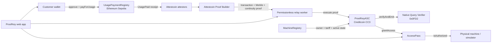

# ProofKey

**Trustless cross-chain pay-per-use access for real-world machines.**

ProofKey lets a customer pay for machine time on Ethereum Sepolia and unlocks a non-transferable access credential on Creditcoin. Attestcoin proves the source transaction to Creditcoin without bridging assets or trusting the relay worker.

**BUIDL CTC 2026 Fall track:** DePIN

**Status:** live testnet MVP · 75 automated tests · verified Sepolia-to-Creditcoin flow

[Launch ProofKey](https://proofkey.vercel.app) · [View the Sepolia payment](https://sepolia.etherscan.io/tx/0xb646bed97cd5ecafec256ea121a3ab7b5d147cce9c38e9e8f5f96cccfd17b967) · [View the Creditcoin authorization](https://creditcoin-testnet.blockscout.com/tx/0x45313262557698e745662272a1da814b74bcebb65b39990b44603c78cca64510)

## The problem

Pay-per-use DePIN systems have a cross-chain trust gap. A machine operator may want settlement liquidity on Ethereum while the machine identity, policy, and access state live on Creditcoin. Typical implementations solve that gap with a custodial bridge, centralized webhook, or privileged backend that can claim a payment happened and unlock the asset.

That makes the backend—not the payment—the real authority.

## The solution

ProofKey makes the source-chain receipt the authority:

1. The operator registers a machine, tariff, controller, and metadata commitment on Creditcoin.
2. The same owner and tariff are mirrored into the authoritative Sepolia payment offer.
3. A customer pays the offer using `UsagePaymentRegistry.payForUsage`.
4. Attestcoin attestors cover the Sepolia block and the Proof Builder returns transaction, Merkle, and continuity evidence.
5. An unprivileged worker submits that evidence to `ProofKeyASC` on Creditcoin.
6. Creditcoin's Native Query Verifier at `0x0FD2` verifies the proof.
7. `ProofKeyASC` decodes the proven receipt, validates every payment invariant, rejects replay, and atomically issues an expiring `AccessPass`.
8. The machine reads `AccessPass.isAuthorized` directly from Creditcoin and fails closed on expiry, deactivation, or RPC failure.

The worker pays gas and provides liveness. It cannot forge a payment, choose a beneficiary, alter a tariff, extend access, or bypass Attestcoin verification.

## Architecture



### Components

| Component              | Responsibility                                                                 |
| ---------------------- | ------------------------------------------------------------------------------ |
| `UsagePaymentRegistry` | Settles ERC-20 usage payments and emits the complete authorization record.     |
| Attestcoin             | Proves Sepolia transaction inclusion and canonical-chain continuity.           |
| Relay worker           | Waits for coverage, obtains the proof, and submits public proof data to CC3.   |
| Native verifier        | Creditcoin precompile `0x0FD2`; cryptographically validates Attestcoin proofs. |
| `ProofKeyASC`          | Decodes the proven receipt, enforces policy, blocks replay, and grants access. |
| `MachineRegistry`      | Stores owner-controlled machine identity, tariff, metadata, and active status. |
| `AccessPass`           | Stores address-bound, expiring, non-transferable access credentials.           |
| Device client          | Reads authorization directly from Creditcoin and fails closed.                 |

## Meaningful Attestcoin integration

Attestcoin is the security boundary, not a decorative API call. `ProofKeyASC.execute` cannot activate access until Creditcoin's native verifier accepts all of the following public proof inputs:

- Attestcoin source chain key and source block height;
- encoded Sepolia transaction and receipt;
- transaction Merkle root and ordered siblings; and
- lower endpoint digest and continuity roots.

After cryptographic verification, `ProofKeyASC` performs application-level validation:

| Validation                            | Why it matters                                                  |
| ------------------------------------- | --------------------------------------------------------------- |
| Chain key must equal Sepolia `1`      | Stops proofs from an unintended source chain.                   |
| Transaction target is immutable       | Accepts only the deployed `UsagePaymentRegistry`.               |
| Receipt status equals success         | A reverted payment cannot authorize access.                     |
| Exactly one authentic `UsagePaid`     | Prevents ambiguous or substituted authorization data.           |
| Event payer equals transaction sender | Binds access to the account that actually paid.                 |
| Beneficiary equals machine owner      | Stops payer- or relay-controlled payout redirection.            |
| Amount equals tariff × duration       | Stops underpayment and worker-supplied pricing.                 |
| Machine exists and is active          | Applies current Creditcoin machine policy.                      |
| Query and order are unprocessed       | Blocks proof replay and the same order under a different proof. |
| Expiry is still in the future         | Prevents stale payments from creating fresh access.             |

The final access grant happens in the same Creditcoin transaction as proof verification. There is no administrator or worker function that can grant access directly.

## What Attestcoin proves—and what it does not

Attestcoin proves that the encoded transaction and successful receipt were included in a covered canonical Sepolia block. ProofKey then proves that the receipt satisfies its on-chain payment policy.

It does **not** prove that a physical excavator exists, that its metadata is factually correct, or that hardware obeyed the authorization. Those physical-world claims still require operator onboarding, device keys or secure hardware, audits, and enforcement appropriate to the production deployment. ProofKey deliberately keeps this boundary explicit: verified blockchain inclusion is not the same as verified physical-world truth.

## Verified live deployment

Recorded September 12, 2026.

| Component                | Network        | Address / transaction                                                                                                             |        Block |
| ------------------------ | -------------- | --------------------------------------------------------------------------------------------------------------------------------- | -----------: |
| ProofKey MockUSDC        | Sepolia        | [`0x43f2…a8247`](https://eth-sepolia.blockscout.com/address/0x43f2a86F5652957Aa5615413D406e037162a8247)                           | `11,691,301` |
| UsagePaymentRegistry     | Sepolia        | [`0xa2D8…127AA`](https://eth-sepolia.blockscout.com/address/0xa2D8dECC5665Fc3B969A58dBCe7Ff05E074127AA)                           | `11,691,302` |
| Live usage payment       | Sepolia        | [`0xb646…7b967`](https://sepolia.etherscan.io/tx/0xb646bed97cd5ecafec256ea121a3ab7b5d147cce9c38e9e8f5f96cccfd17b967)              | `11,691,323` |
| MachineRegistry          | Creditcoin CC3 | [`0x43f2…a8247`](https://creditcoin-testnet.blockscout.com/address/0x43f2a86F5652957Aa5615413D406e037162a8247)                    |  `5,476,972` |
| AccessPass               | Creditcoin CC3 | [`0xa2D8…127AA`](https://creditcoin-testnet.blockscout.com/address/0xa2D8dECC5665Fc3B969A58dBCe7Ff05E074127AA)                    |  `5,476,973` |
| ProofKeyASC              | Creditcoin CC3 | [`0x79fA…775e7`](https://creditcoin-testnet.blockscout.com/address/0x79fA79C1fdc7eFaA75Bc039CdbdFc1ce109775e7)                    |  `5,476,974` |
| Attestcoin authorization | Creditcoin CC3 | [`0x4531…64510`](https://creditcoin-testnet.blockscout.com/tx/0x45313262557698e745662272a1da814b74bcebb65b39990b44603c78cca64510) |  `5,477,036` |

Live identifiers:

- Attestcoin source chain key: `1`
- Proven Sepolia block: `11691323`
- Machine ID: `0xc04beae61beb9471c4f24c8788a4624988d2948a5c3d3dd0b6ba1b76028775bcc`
- Order ID: `0x629c460ef76530434d56fff43d823d0ae513a1af57218dadf2de953dd86cf062`

The secret-free deployment record is in [`packages/contracts/deployments/live-mvp.json`](packages/contracts/deployments/live-mvp.json). [`packages/contracts/fixtures/recorded-live-proof.json`](packages/contracts/fixtures/recorded-live-proof.json) contains the real proof material and is explicitly labeled `recorded-live` / `fresh: false`; it is historical evidence, not a fresh or replayable authorization.

All five deployed contracts are fully source-verified on Blockscout using the exact committed Hardhat compiler settings. Re-run `npm run verify:contracts` after compiling to verify the recorded deployments idempotently.

## Quick start

### Requirements

- Node.js 24 or newer
- npm 11.17.0
- MetaMask or another EIP-1193 browser wallet for the customer flow

```bash
git clone https://github.com/EcstaceeLOR/ProofKey.git
cd ProofKey
npm ci
cp .env.example .env
npm run check
```

On Windows PowerShell, use `Copy-Item .env.example .env`.

The complete local check does not require a funded wallet or private RPC endpoint.

## Run the applications

Set the public `VITE_*` addresses from the committed deployment manifests and provide a Sepolia RPC URL in the ignored root `.env`. Live relaying also requires `WORKER_PRIVATE_KEY`, `SEPOLIA_USAGE_PAYMENT_REGISTRY_ADDRESS`, and `PROOFKEY_ASC_ADDRESS`; the required fields are documented in `.env.example`. Never place private keys in `VITE_*` variables.

Start each application in a separate terminal:

```bash
# Attestcoin relay API
npm run serve --workspace @proofkey/worker

# Customer payment and proof journey
npm run dev --workspace @proofkey/web

# Fail-closed machine simulator
npm run dev --workspace @proofkey/device
```

The customer UI connects a wallet, switches to Sepolia, calculates exact token units without floating-point arithmetic, approves the payment token, settles usage, queues the Attestcoin relay, displays every proof phase, and reveals access only after Creditcoin execution succeeds.

## Verify the recorded result

With Sepolia and Creditcoin RPC URLs in `.env`, independently verify deployed bytecode, receipts, proof-to-payment linkage, processed-order state, and the recorded credential:

```bash
npm run live:verify
```

Expected core result:

```json
{
  "verified": true,
  "sourceTransactionHash": "0xb646bed97cd5ecafec256ea121a3ab7b5d147cce9c38e9e8f5f96cccfd17b967",
  "creditcoinTransactionHash": "0x45313262557698e745662272a1da814b74bcebb65b39990b44603c78cca64510"
}
```

`activeNow` may become `false` after the recorded 24-hour pass expires; the verifier still confirms that the original order was processed and the credential matches the proven payment.

## Tests

```bash
npm run check
```

The gate runs formatting, TypeScript checks, all automated tests, Solidity compilation, and production builds.

| Suite            |  Tests | Coverage focus                                                                                    |
| ---------------- | -----: | ------------------------------------------------------------------------------------------------- |
| Solidity         |     52 | Receipt semantics, proof tampering, replay, authorization, pricing, ownership, expiry, reentrancy |
| Relay worker     |     12 | Phase transitions, retries, idempotency, persistence, HTTP validation, secret-safe evidence       |
| Customer web     |      5 | Fail-closed proof state, journey mapping, exact token math, rental windows                        |
| Device simulator |      6 | Locked/unlocking/unlocked/expired states, tampered results, RPC failure                           |
| **Total**        | **75** |                                                                                                   |

The Solidity suite uses explicit verifier doubles at `0x0FD2` to isolate adversarial proof cases. Those tests are distinct from the committed live CC3 transaction, which executed against Creditcoin's real Native Query Verifier.

## Repository structure

| Path                             | Purpose                                                     |
| -------------------------------- | ----------------------------------------------------------- |
| `packages/contracts`             | Sepolia settlement and Creditcoin authorization contracts   |
| `apps/worker`                    | Attestcoin proof generation, relay state machine, and API   |
| `apps/web`                       | Customer-facing payment and authorization experience        |
| `apps/device`                    | Direct, fail-closed Creditcoin authorization reader         |
| `packages/contracts/deployments` | Public live addresses, receipts, blocks, and explorer links |
| `packages/contracts/fixtures`    | Clearly labeled historical Attestcoin proof evidence        |

## Security properties

- **No bridge custody:** payment assets remain on the source chain.
- **No privileged relay:** any funded account can submit the public proof, but only a valid proof can change access.
- **No administrative grant path:** `AccessPass` accepts only the one-time-initialized `ProofKeyASC` authorizer.
- **Exact economic binding:** owner, beneficiary, tariff, duration, payer, and amount are validated from on-chain state and proven receipt data.
- **Replay protection:** both Attestcoin query IDs and ProofKey order IDs are consumed once.
- **Non-transferable credentials:** access is keyed by machine and payer rather than represented by a transferable token.
- **Fail-closed clients:** the machine locks on expiry, deactivation, malformed data, rejected proof, or RPC failure.
- **Secret hygiene:** deployment evidence is recursively checked for secret-bearing fields before it is written.

## Current limitations

- The MVP supports Ethereum Sepolia through Attestcoin chain key `1`; additional source chains require explicit contract and policy configuration.
- `MockUSDC` is permissionless testnet currency and must never be presented as production USDC.
- The relay is required for liveness, although never for authorization trust. Production deployments should run multiple relayers.
- Machine metadata is a hash commitment, not an oracle-certified statement about the physical asset.
- The simulator demonstrates the control decision; production hardware still needs secure key storage, authenticated control channels, and tamper resistance.
- The customer and device applications are hackathon clients, not audited production interfaces.

## Networks

| Network                  | Chain ID   | RPC                                          | Explorer                                    |
| ------------------------ | ---------- | -------------------------------------------- | ------------------------------------------- |
| Ethereum Sepolia         | `11155111` | Supply a provider URL in `.env`              | `https://sepolia.etherscan.io`              |
| Creditcoin Testnet (CC3) | `102031`   | `https://rpc.cc3-testnet.creditcoin.network` | `https://creditcoin-testnet.blockscout.com` |

Official Creditcoin endpoint documentation: <https://docs.creditcoin.org/smart-contract-guides/creditcoin-endpoints>

## Built with

- [Creditcoin](https://creditcoin.org/) and the [Attestcoin Protocol](https://creditcoin.org/Deploy)
- [`@gluwa/usc-sdk`](https://www.npmjs.com/package/@gluwa/usc-sdk) for Attestcoin coverage and proof retrieval
- [`@gluwa/asc-contracts`](https://www.npmjs.com/package/@gluwa/asc-contracts) for the native verifier interface and EVM receipt decoder
- [ethers](https://github.com/ethers-io/ethers.js), [Hardhat](https://hardhat.org/), and [Vite](https://vite.dev/)

ProofKey is released under the [MIT License](LICENSE). Third-party packages retain their respective licenses.
